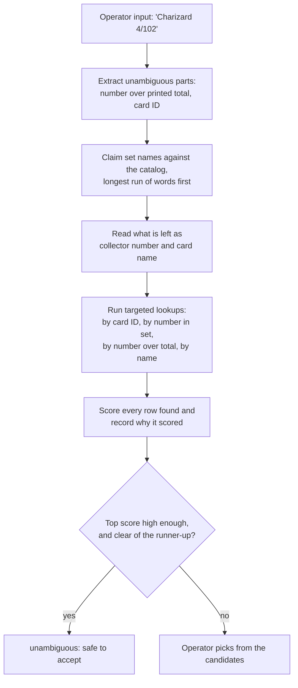
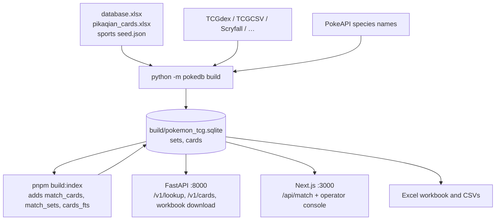

# tfg-tcg-database

Multi-game trading and sports card catalog for a grading workflow: Pokémon (all
languages), other TCGs (Magic, Yu-Gi-Oh, One Piece, Lorcana, …), and curated
sports / entertainment checklists (Topps, Panini, Upper Deck, …).

| Part | What it is | Start here |
| --- | --- | --- |
| **Card data** | The Python pipeline that merges sources into one SQLite database, an Excel workbook, and a JSON API. | [Card data](#card-data) |
| **Web app** | A Next.js card matching service and operator console, reading that same database. | [Web app](#web-app) |
| **Export scripts** | Standalone scripts in `apis/` for TCGdex, TCGCSV, Scryfall, YGOPRODeck, PikaQian, … | [Export scripts](#export-scripts) |
| **Data sources** | Which games have APIs vs need curation | [docs/DATA_SOURCES.md](docs/DATA_SOURCES.md) |

> **One database, two services.** `python -m pokedb build` produces
> `build/pokemon_tcg.sqlite`, and that file is the single source of truth. Both
> the FastAPI service and the Next.js app read it — there is no second copy of
> the card data. See [How the pieces fit](#how-the-pieces-fit).

---

# Card data

Pokémon remains the densest catalog (~2,200 sets / ~145k cards across 16
languages after a TCGdex refresh). Other TCGs and sports checklists land in the
**same** SQLite file once you fetch their dumps — see
[docs/DATA_SOURCES.md](docs/DATA_SOURCES.md). Export is **one Excel workbook**
and a **JSON API**. Find a card from the set name, the number printed on it, the
card name and the year it was released.

| | |
|---|---|
| Workbook | [`exports/Pokemon_TCG_Card_Database.xlsx`](exports/Pokemon_TCG_Card_Database.xlsx) |
| Refresh | `python -m pokedb update`, or the API's own timer |

## The workbook

One file, four sheets:

- **Cards** - one row per card: Language, Set Name, Card Number, Card Name,
  Year, plus the English set/card name and set code.
- **Sets** - one row per set: name, code, release date, series and card counts.
- **Coverage** - how many sets and cards exist per language.
- **About** - when it was generated and from what.

Row 1 of every sheet has filter arrows: filter by Language, then Set Name (or
Set Code), then Card Number. `Cards In Set` is the printed set size, so any card
numbered above it is a secret rare.

The workbook is regenerated from scratch on every update, so corrections belong
in the source spreadsheets (below), not in the output file.

## The lookup API

```bash
pip install -r requirements.txt
python -m pokedb update                 # download, build, export
uvicorn pokedb.api:app --host 0.0.0.0 --port 8000
```

Interactive documentation is served at `/docs`.

| Endpoint | Purpose |
|---|---|
| `GET /v1/lookup?set=SVI&number=004/198` | Identify a card from what is printed on it |
| `GET /v1/cards?q=Charizard&language=ja` | Search cards, in any language, by English or local name |
| `GET /v1/sets?language=en&year=2024` | List sets |
| `GET /v1/sets/{set_uid}/cards` | Every card in a set |
| `GET /v1/languages` | Languages and their coverage |
| `GET /v1/download/workbook` | Download the current Excel workbook |
| `GET /health` | Liveness plus when the data was last built |

`lookup` is the grading-intake endpoint: it accepts a set code (`SVI`), an
English set name (`Surging Sparks`) or a local one (`スカーレットex`), and a
number written as `4`, `004` or `004/198`. Exact set matches rank above partial
ones.

### Deploying it

```bash
docker compose up -d          # http://localhost:8000
```

The first boot builds the database before serving, which takes a few minutes;
after that it is cached in a volume. The image has not been built and run in CI
yet, so treat the compose file as a starting point rather than a tested
deployment.

### Keeping it up to date

The service rebuilds itself on a timer - `POKEDB_REFRESH_HOURS` (default 24) -
by re-downloading the sources, building a new database file and swapping it in
atomically, so queries are never interrupted. Set it to `0` to disable, and
trigger a rebuild on demand with `POST /v1/admin/refresh` (bearer
`POKEDB_ADMIN_TOKEN`).

| Variable | Default | Meaning |
|---|---|---|
| `POKEDB_DB` | `build/pokemon_tcg.sqlite` | Database location |
| `POKEDB_REFRESH_HOURS` | `24` | Hours between automatic rebuilds, `0` to disable |
| `POKEDB_ADMIN_TOKEN` | unset | Token for `POST /v1/admin/refresh` |
| `POKEDB_CORS_ORIGINS` | `*` | Comma separated allowed origins |

## Where the data comes from

| Source | Contributes |
|---|---|
| [TCGdex](https://tcgdex.dev) API | Card lists for 16 languages, set codes and release dates |
| `database.xlsx` | Hand-curated master set list (English, Japanese, Simplified Chinese) with abbreviations and release dates |
| `pikaqian_cards.xlsx` | Simplified Chinese cards - 12,323 of them, against 877 in the API |
| [PokéAPI](https://pokeapi.co) species names | English names for cards printed in Japanese, Chinese, Korean and the European languages |
| `tcgdex_cards.xlsx` | Not imported; `python -m pokedb verify` checks it against the API to catch cards the API has dropped |

The same set is described differently by each source, so sets are linked by
folded set code first (`CSM1cC` = `csm1cc`), then by name, then by a unique
release date. A release-year guard stops codes that were reused across eras
from merging - `G1` is Gym Heroes in `database.xlsx` and Generations in TCGdex.
Where sources disagree on a release date, `database.xlsx` wins; every
disagreement is listed in `exports/reconciliation.csv`.

English names for Japanese, Chinese and Korean cards are derived from the
species name (リザードンex becomes "Charizard ex") and marked `pokeapi` in the
`name_en_source` column. Names with an owner prefix are left untranslated
rather than risk a wrong name on a label.

Other games and sports checklists are documented in
[docs/DATA_SOURCES.md](docs/DATA_SOURCES.md). Pokémon still comes from the
sources above. Magic, Yu-Gi-Oh, One Piece and similar TCGs load from TCGCSV /
Scryfall / etc. after `python -m pokedb fetch --source …`. Sports cards use
curated JSON/xlsx — see [docs/SPORTS.md](docs/SPORTS.md).

`card_uid` is `'<game>:<language>:<set slug>#<number>[#<parallel>]'` (for
example `pokemon:en:bs#4`). Legacy Pokémon IDs without the game prefix still
match; store the new form on new grading records. See
[docs/MIGRATION.md](docs/MIGRATION.md).

## Commands

```bash
PYTHONPATH=src python3 -m pokedb update         # fetch TCGdex, build, export, report
PYTHONPATH=src python3 -m pokedb fetch          # download (default: tcgdex)
PYTHONPATH=src python3 -m pokedb fetch-tcgcsv --game onepiece
PYTHONPATH=src python3 -m pokedb fetch-scryfall
PYTHONPATH=src python3 -m pokedb fetch-sports   # TCDB / Beckett staging help
PYTHONPATH=src python3 -m pokedb build --game sports
PYTHONPATH=src python3 -m pokedb export
PYTHONPATH=src python3 -m pokedb report
PYTHONPATH=src python3 -m pokedb verify
```

Tests: `pip install -r requirements-dev.txt && PYTHONPATH=src pytest`. They use a
small in-memory dataset, so they need no network access.

Also written: `exports/sets.csv`, `exports/cards.csv.gz` (for loading into
another system) and `exports/reconciliation.csv` (sets with no card list, and
release dates the sources disagree on).

**Licensing:** Bandai, Konami, Ravensburger, Wizards, Topps, and Panini assert
rights over card data and images. Fine for an **internal grading tool**; do not
republish catalogs without a license. See [docs/DATA_SOURCES.md](docs/DATA_SOURCES.md).

## Adding or correcting data

Add a sheet or rows to `database.xlsx` - one sheet per language, named after it
("English Sets", "Korean Sets"), with columns `#`, `Set Name`, `Abbreviation`,
`Release Date` and `Series`. Anything you add is merged into the next build and
takes precedence over the API, which is how you correct a wrong release date or
add a set the public sources do not carry.

## Coverage

Card lists are complete for English and the main European languages, and thin
for Japanese, Korean, Thai and Indonesian, where the public sources only carry
part of the catalogue. `python -m pokedb report` prints the current state and
`exports/reconciliation.csv` lists every set that has no card list yet.

---

# Web app

The card matching service and operator console. Given whatever an operator can
read off a physical card — a name in any language, a collector number, a set
code — it returns the catalog rows that card could be, ranked, with the reason
each one matched. Built with **Next.js (App Router) + TypeScript**, **SQLite**
via `better-sqlite3`, and **Tailwind CSS**.

It reads the card data built above — it does not build or own any of it. On top
of the canonical `cards` and `sets` tables it maintains a **match index** in the
same file (`match_cards`, `match_sets`, `cards_fts`) holding normalized
comparison keys and a full-text index. That index is derived, so it is rebuilt
rather than edited, and the app rebuilds it by itself whenever it finds one
missing or older than the current build.

The console at `/` has two modes. **Identify** takes what is printed on a card
and shows the ranked candidates with the reason each matched, through the same
`/api/match` endpoint the grading program calls. For sports cards, pick Game →
Sports and fill in **Set / Subject / Parallel / Number** (optional serial for
display only). **Browse** pages through the catalog by name, set and collector
number, for when a card has to be found by working through a set instead.

## Getting started

Requires Node.js 22+ and pnpm, and the card data from above.

```bash
pip install -r requirements.txt
PYTHONPATH=src python3 -m pokedb update   # build the card database (once)

pnpm install
pnpm build:index                          # derive the match index (~1 second)
pnpm dev                                  # http://localhost:3000
```

Later refreshes are one command: `pnpm refresh` rebuilds **Pokémon** card data
(TCGdex) and the match index. For other TCGs use `pnpm refresh:games`,
`pnpm fetch:mtg`, or `pnpm fetch:onepiece` — see
[docs/DATA_SOURCES.md](docs/DATA_SOURCES.md). Scryfall is never part of the
default refresh (hundreds of MB).

### Deploying on Fly.io

The dark-mode console runs at
[tfg-tcg-database.fly.dev](https://tfg-tcg-database.fly.dev) via
`Dockerfile.web` + a volume-mounted SQLite file. Seed and refresh steps are in
[docs/DEPLOY_FLY.md](docs/DEPLOY_FLY.md).

If `build/pokemon_tcg.sqlite` does not exist the app says so and stops, rather
than serving an empty catalog. Point it elsewhere with `POKEDB_DB`, the same
variable the Python service uses.

## How matching works

Free text is read in stages, because the same token can mean different things.
`SV1a` is a Japanese set code and `TG01` is a collector number, and telling them
apart requires knowing which sets exist. So the catalog is consulted for set
names first, and only what remains is read as a number or a card name.



A set plus a collector number identifies a TCG printing outright, so that pair
is enough to report `unambiguous`. A name and number without a language usually
is not: the Base Set Charizard is card 4 of 102 in English, French and German,
and only the language separates them. Those come back as tied candidates for a
human to settle.

Sports matching is a separate path: set title + number is **not** enough to
auto-accept when that number has parallel siblings (base Beckham #38 vs Halo
Ref). `09/15` in the card line is a print run / serial, not a printed total.

Names are matched through an FTS5 **trigram** index, which is what makes partial
Japanese and Chinese names findable — a word tokenizer cannot split CJK text.

## API

All endpoints are read-only; the catalog is loaded from the spreadsheets, never
written to over HTTP.

| Method | Route | Description |
| ------ | ----- | ----------- |
| POST | `/api/match` | Rank catalog rows against a described card |
| GET | `/api/match?q=` | Same, for quick checks from a browser or shell |
| GET | `/api/cards` | Search (`q`, `game`, `language`, `set`, `number`, `limit`, `offset`) |
| GET | `/api/cards/:id` | One card by catalog ID (`card_uid`, URL-encoded) |
| GET | `/api/sets` | Sets (`game`, `language`, `q`, `limit`) |
| GET | `/api/languages` | Languages with card counts; also returns `games` |
| GET | `/api/games` | Games with card counts |

```bash
curl -X POST http://localhost:3000/api/match \
  -H 'Content-Type: application/json' \
  -d '{"query": "Charizard 4/102", "language": "en"}'
```

```jsonc
{
  "interpretation": {          // how the input was read, to show back to an operator
    "name": "Charizard", "number": "4", "printedTotal": 102, "language": "en", "sets": []
  },
  "candidates": [
    {
      "card": { "source_card_id": "base1-4", "set_name": "Base Set", "card_number": "4", "name": "Charizard" },
      "score": 70,
      "matchedOn": ["collector number", "printed total", "name"]
    }
  ],
  "unambiguous": true          // one decisive match: safe to accept without review
}
```

`name`, `language`, `game`, `set`, `number`, `printedTotal` and `cardId` can be
sent instead of `query` when the caller already has them separated. Sports
grading uses `game: "sports"` plus `set`, `name` (card line) and `number`:

```bash
curl -X POST http://localhost:3000/api/match \
  -H 'Content-Type: application/json' \
  -d '{"game":"sports","set":"2025-26 TOPPS MANCHESTER UNITED TEAM SET","name":"SIR DAVID BECKHAM - HALO REF.","number":"38"}'
```

## Scripts

| Command | Description |
| ------- | ----------- |
| `pnpm dev` | Development server on port 3000 |
| `pnpm build:index` | Derive the match index from the card database |
| `pnpm refresh` | TCGdex (Pokémon) fetch + build + match index |
| `pnpm refresh:games` | Also TCGCSV / YGOPRODeck / Lorcast / GoAgain / apitcg |
| `pnpm fetch:mtg` | Scryfall bulk download only (then `build` + `build:index`) |
| `pnpm fetch:onepiece` | TCGCSV + apitcg for One Piece |
| `pnpm build` / `pnpm start` | Production build and server |
| `pnpm lint` | ESLint |
| `pnpm test` | Vitest suite |

---

# How the pieces fit

There is **one** card database. Python builds it; both services read it.



Only the Python build writes the `sets` and `cards` tables. The Next.js side
writes nothing except its own derived match index, in the same file, which can
be thrown away and rebuilt at any time.

Both services can run at once — different ports, one dataset, and the same
`card_uid` in both, so a grading record refers to the same card whichever
answered.

| Use | Endpoint |
|---|---|
| Identify a card from free text, with scores and an `unambiguous` flag | `POST /api/match` (Next.js) |
| Identify a card from a known set plus number | either; `/v1/lookup` if you are already on the Python service |
| Browse or search the catalog, paginated | `GET /api/cards` or `GET /v1/cards` |
| Download the Excel workbook | `GET /v1/download/workbook` (Python) |

The one thing only the Next.js service does is free-text matching: a single box
that reads "Charizard 4/102" or "SV1a 001", scores the candidates, explains why
each matched, and says whether the top hit is safe to accept without a human.
Sports cards use the same endpoint with three structured fields.

Bandai, Konami, Wizards, Ravensburger, Topps, and Panini assert rights over card
data and images. This catalog is for an **internal grading tool**; do not
republish it without a license. See [docs/DATA_SOURCES.md](docs/DATA_SOURCES.md).

---

# Export scripts

`apis/` holds standalone scripts for spreadsheet / dump workflows. They run
independently of the `pokedb` pipeline (which fetches into `data/raw/` itself):

| Script | Purpose |
| --- | --- |
| `tcgdex_export.py` | Pokémon workbook; `id` column feeds `pokedb verify` |
| `tcgcsv_export.py` | One TCGplayer category → xlsx (`--game onepiece`) |
| `scryfall_export.py` | Magic bulk dump (`all_cards` / `default_cards`) |
| `ygoprodeck_export.py` | Yu-Gi-Oh! JSON per language |
| `pikaqian_export.py` / `pokemontcgio_export.py` / `pokewallet_export.py` | Pokémon sources with API keys |

API keys are read from the environment, never hard-coded — see
[`.env.example`](.env.example). Earlier commits contained live keys, so the
PikaQian, PokéWallet and pokemontcg.io keys in git history must be treated as
compromised and reissued.

```bash
pip install -r apis/requirements.txt

python3 apis/tcgdex_export.py           # no key needed, ~20 seconds
python3 apis/tcgcsv_export.py --game onepiece
python3 apis/scryfall_export.py --type default_cards
python3 apis/ygoprodeck_export.py --language en
POKEMONTCGIO_API_KEY=... python3 apis/pokemontcgio_export.py
PIKAQIAN_API_KEY=...     python3 apis/pikaqian_export.py    # 500 requests/MONTH
POKEWALLET_API_KEY=...   python3 apis/pokewallet_export.py  # 100/hour, 1000/day
```

`tcgdex_export.py` covers all 13 languages TCGdex carries card data for and
records each set's abbreviation, printed total and release date, which is what
lets a card be found from "BS 4" or "4/102". Its `id` column is TCGdex's card
identifier, which `python -m pokedb verify` compares against a fresh download.
