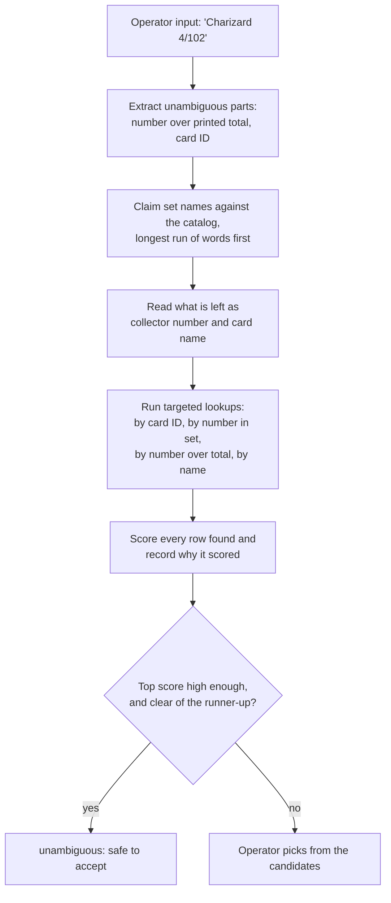

# pokemon-tcg-database

Every official Pokémon Trading Card Game set and card, in every language it has
been printed in, plus the tools to browse and serve it.

| Part | What it is | Start here |
| --- | --- | --- |
| **Card data** | A Python pipeline that merges the public sources into one Excel workbook and a JSON lookup API. Built for card identification at grading intake. | [Card data](#card-data) |
| **Web app** | A Next.js app that loads the same spreadsheets into its own SQLite catalog and serves a card matching API plus an operator console. | [Web app](#web-app) |
| **Export scripts** | The standalone scripts (`apis/`) that produced the spreadsheets in this repo. | [Export scripts](#export-scripts) |

> **Two lookup implementations currently coexist.** The Python pipeline serves
> `GET /v1/lookup` and the Next.js app serves `POST /api/match`; both identify a
> card from its set, collector number, name and language, from the same source
> spreadsheets. They were built in parallel and neither has been retired. See
> [Which lookup should survive](#which-lookup-should-survive) before building on
> either.

---

# Card data

2,206 sets and 144,851 cards across 16 languages, as **one Excel workbook** and
a **JSON API**. Find a card from the set name, the number printed on it, the
card name and the year it was released.

| | |
|---|---|
| Workbook | [`exports/Pokemon_TCG_Card_Database.xlsx`](exports/Pokemon_TCG_Card_Database.xlsx) |
| Refresh | `python -m pokedb update`, or the API's own timer |

## The workbook

One file, four sheets:

- **Cards** - one row per card: Language, Set Name, Card Number, Card Name,
  Year, plus the English set/card name and set code.
- **Sets** - one row per set: name, code, release date, series and card counts.
- **Coverage** - how many sets and cards exist per language.
- **About** - when it was generated and from what.

Row 1 of every sheet has filter arrows: filter by Language, then Set Name (or
Set Code), then Card Number. `Cards In Set` is the printed set size, so any card
numbered above it is a secret rare.

The workbook is regenerated from scratch on every update, so corrections belong
in the source spreadsheets (below), not in the output file.

## The lookup API

```bash
pip install -r requirements.txt
python -m pokedb update                 # download, build, export
uvicorn pokedb.api:app --host 0.0.0.0 --port 8000
```

Interactive documentation is served at `/docs`.

| Endpoint | Purpose |
|---|---|
| `GET /v1/lookup?set=SVI&number=004/198` | Identify a card from what is printed on it |
| `GET /v1/cards?q=Charizard&language=ja` | Search cards, in any language, by English or local name |
| `GET /v1/sets?language=en&year=2024` | List sets |
| `GET /v1/sets/{set_uid}/cards` | Every card in a set |
| `GET /v1/languages` | Languages and their coverage |
| `GET /v1/download/workbook` | Download the current Excel workbook |
| `GET /health` | Liveness plus when the data was last built |

`lookup` is the grading-intake endpoint: it accepts a set code (`SVI`), an
English set name (`Surging Sparks`) or a local one (`スカーレットex`), and a
number written as `4`, `004` or `004/198`. Exact set matches rank above partial
ones.

### Deploying it

```bash
docker compose up -d          # http://localhost:8000
```

The first boot builds the database before serving, which takes a few minutes;
after that it is cached in a volume. The image has not been built and run in CI
yet, so treat the compose file as a starting point rather than a tested
deployment.

### Keeping it up to date

The service rebuilds itself on a timer - `POKEDB_REFRESH_HOURS` (default 24) -
by re-downloading the sources, building a new database file and swapping it in
atomically, so queries are never interrupted. Set it to `0` to disable, and
trigger a rebuild on demand with `POST /v1/admin/refresh` (bearer
`POKEDB_ADMIN_TOKEN`).

| Variable | Default | Meaning |
|---|---|---|
| `POKEDB_DB` | `build/pokemon_tcg.sqlite` | Database location |
| `POKEDB_REFRESH_HOURS` | `24` | Hours between automatic rebuilds, `0` to disable |
| `POKEDB_ADMIN_TOKEN` | unset | Token for `POST /v1/admin/refresh` |
| `POKEDB_CORS_ORIGINS` | `*` | Comma separated allowed origins |

## Where the data comes from

| Source | Contributes |
|---|---|
| [TCGdex](https://tcgdex.dev) API | Card lists for 16 languages, set codes and release dates |
| `database.xlsx` | Hand-curated master set list (English, Japanese, Simplified Chinese) with abbreviations and release dates |
| `pikaqian_cards.xlsx` | Simplified Chinese cards - 12,323 of them, against 877 in the API |
| [PokéAPI](https://pokeapi.co) species names | English names for cards printed in Japanese, Chinese, Korean and the European languages |
| `tcgdex_cards.xlsx` | Not imported; `python -m pokedb verify` checks it against the API to catch cards the API has dropped |

The same set is described differently by each source, so sets are linked by
folded set code first (`CSM1cC` = `csm1cc`), then by name, then by a unique
release date. A release-year guard stops codes that were reused across eras
from merging - `G1` is Gym Heroes in `database.xlsx` and Generations in TCGdex.
Where sources disagree on a release date, `database.xlsx` wins; every
disagreement is listed in `exports/reconciliation.csv`.

English names for Japanese, Chinese and Korean cards are derived from the
species name (リザードンex becomes "Charizard ex") and marked `pokeapi` in the
`name_en_source` column. Names with an owner prefix are left untranslated
rather than risk a wrong name on a label.

## Commands

```bash
python -m pokedb update    # fetch, build, export, report - the usual refresh
python -m pokedb fetch     # download the latest data only
python -m pokedb build     # merge the sources into build/pokemon_tcg.sqlite
python -m pokedb export    # write the workbook and CSVs
python -m pokedb report    # coverage and source disagreements
python -m pokedb verify    # check tcgdex_cards.xlsx against the API
```

Tests: `pip install -r requirements-dev.txt && pytest`. They use a small
in-memory dataset, so they need no network access.

Also written: `exports/sets.csv`, `exports/cards.csv.gz` (for loading into
another system) and `exports/reconciliation.csv` (sets with no card list, and
release dates the sources disagree on).

## Adding or correcting data

Add a sheet or rows to `database.xlsx` - one sheet per language, named after it
("English Sets", "Korean Sets"), with columns `#`, `Set Name`, `Abbreviation`,
`Release Date` and `Series`. Anything you add is merged into the next build and
takes precedence over the API, which is how you correct a wrong release date or
add a set the public sources do not carry.

## Coverage

Card lists are complete for English and the main European languages, and thin
for Japanese, Korean, Thai and Indonesian, where the public sources only carry
part of the catalogue. `python -m pokedb report` prints the current state and
`exports/reconciliation.csv` lists every set that has no card list yet.

---

# Web app

The card matching service and operator console. Given whatever an operator can
read off a physical card — a name in any language, a collector number, a set
code — it returns the catalog rows that card could be, ranked, with the reason
each one matched. Built with **Next.js (App Router) + TypeScript**, **SQLite**
via `better-sqlite3`, and **Tailwind CSS**.

It loads the source spreadsheets into its own catalog at `data/catalog.db`:
145,018 printings across 13 languages, from `tcgdex_cards.xlsx` (132,695) and
`pikaqian_cards.xlsx` (12,323, Simplified Chinese). Each row holds only what
identifies a printing — language, set, collector number, printed total, name,
and the English name where a source provides one. No rarity, type, HP or images.

The console at `/` has two modes. **Identify** takes what is printed on a card
and shows the ranked candidates with the reason each matched, through the same
`/api/match` endpoint the grading program calls. **Browse** pages through the
catalog by name, set and collector number, for when a card has to be found by
working through a set instead.

## Getting started

Requires Node.js 22+ and pnpm.

```bash
pnpm install          # install dependencies
pnpm import:catalog   # load the spreadsheets into SQLite (~6 seconds)
pnpm dev              # start the server at http://localhost:3000
```

The catalog is **not** seeded automatically: a fresh checkout answers queries
against an empty database until `pnpm import:catalog` has run.

## How matching works

Free text is read in stages, because the same token can mean different things.
`SV1a` is a Japanese set code and `TG01` is a collector number, and telling them
apart requires knowing which sets exist. So the catalog is consulted for set
names first, and only what remains is read as a number or a card name.



A set plus a collector number identifies a printing outright, so that pair is
enough to report `unambiguous`. A name and number without a language usually is
not: the Base Set Charizard is card 4 of 102 in English, French and German, and
only the language separates them. Those come back as tied candidates for a
human to settle.

Names are matched through an FTS5 **trigram** index, which is what makes partial
Japanese and Chinese names findable — a word tokenizer cannot split CJK text.

## API

All endpoints are read-only; the catalog is loaded from the spreadsheets, never
written to over HTTP.

| Method | Route | Description |
| ------ | ----- | ----------- |
| POST | `/api/match` | Rank catalog rows against a described card |
| GET | `/api/match?q=` | Same, for quick checks from a browser or shell |
| GET | `/api/cards` | Search (`q`, `language`, `set`, `number`, `source`, `limit`, `offset`) |
| GET | `/api/cards/:id` | One card by catalog ID |
| GET | `/api/sets` | Sets (`language`, `q`, `limit`) |
| GET | `/api/languages` | Languages with card counts |

```bash
curl -X POST http://localhost:3000/api/match \
  -H 'Content-Type: application/json' \
  -d '{"query": "Charizard 4/102", "language": "en"}'
```

```jsonc
{
  "interpretation": {          // how the input was read, to show back to an operator
    "name": "Charizard", "number": "4", "printedTotal": 102, "language": "en", "sets": []
  },
  "candidates": [
    {
      "card": { "source_card_id": "base1-4", "set_name": "Base Set", "card_number": "4", "name": "Charizard" },
      "score": 70,
      "matchedOn": ["collector number", "printed total", "name"]
    }
  ],
  "unambiguous": true          // one decisive match: safe to accept without review
}
```

`name`, `language`, `set`, `number`, `printedTotal` and `cardId` can be sent
instead of `query` when the caller already has them separated.

## Scripts

| Command | Description |
| ------- | ----------- |
| `pnpm dev` | Development server on port 3000 |
| `pnpm import:catalog` | Load the spreadsheets into SQLite (`--reset` to rebuild) |
| `pnpm build` / `pnpm start` | Production build and server |
| `pnpm lint` | ESLint |
| `pnpm test` | Vitest suite |

---

# Which lookup should survive

Two independent implementations of card lookup now live in this repo, built in
parallel from the same spreadsheets:

| | Python (`src/pokedb`) | Next.js (`src/app`, `src/lib`) |
|---|---|---|
| Lookup endpoint | `GET /v1/lookup?set=&number=` | `POST /api/match` |
| Input | Set and number as separate fields | Either one free-text string or separate fields |
| Result | Rows ranked by set-match kind | Scored candidates, the reasons each matched, and an `unambiguous` flag |
| Name search | `LIKE` over name columns | FTS5 trigram index, so partial CJK names match |
| Sources merged | database.xlsx, pikaqian, TCGdex, with per-source provenance | tcgdex and pikaqian workbooks |
| English names for JA/ZH/KO | Derived from PokéAPI species names | Only where a source supplies one |
| Deployment | Docker, self-refreshing on a timer, weekly CI rebuild | `pnpm import:catalog`, run by hand |
| Operator UI | none | Yes, on `/` |

Neither is a superset of the other. The Python side has the stronger data
pipeline — multi-source merging with provenance, PokéAPI-derived English names
for Japanese, Chinese and Korean cards, and an automated refresh. The Next.js
side has the stronger matching — one free-text box, explainable scores, an
`unambiguous` flag a grading program can act on, and substring search that works
in CJK.

The obvious end state is one service: keep the Python pipeline as the builder
and have the matching layer read `build/pokemon_tcg.sqlite` instead of
maintaining a second importer. That is a decision to make deliberately, not a
merge to resolve, so both are left in place for now.

---

# Export scripts

`apis/` holds the standalone scripts that produced the spreadsheets in this
repo: `tcgdex_export.py` (which wrote `tcgdex_cards.xlsx`),
`pikaqian_export.py` (`pikaqian_cards.xlsx`), plus exporters for pokemontcg.io
and PokeWallet with resumable checkpoints. They run independently of the
`pokedb` pipeline, which fetches from TCGdex itself.

API keys are read from the environment, never hard-coded — see
[`.env.example`](.env.example). Earlier commits contained live keys, so the
PikaQian, PokéWallet and pokemontcg.io keys in git history must be treated as
compromised and reissued.

```bash
pip install -r apis/requirements.txt

python3 apis/tcgdex_export.py           # no key needed, ~20 seconds
POKEMONTCGIO_API_KEY=... python3 apis/pokemontcgio_export.py
PIKAQIAN_API_KEY=...     python3 apis/pikaqian_export.py    # 500 requests/MONTH
POKEWALLET_API_KEY=...   python3 apis/pokewallet_export.py  # 100/hour, 1000/day
```

`tcgdex_export.py` covers all 13 languages TCGdex carries card data for and
records each set's abbreviation, printed total and release date, which is what
lets a card be found from "BS 4" or "4/102". Its `id` column is TCGdex's card
identifier, which `python -m pokedb verify` compares against a fresh download.
