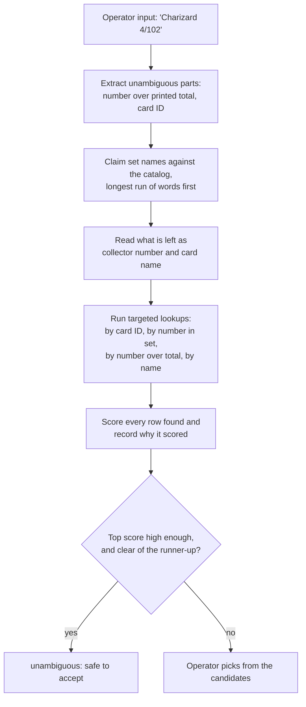

# pokemon-tcg-database

The card catalog behind a Pokémon card grading workflow. Given whatever an
operator can read off a physical card — a name in any language, a collector
number, a set code — it returns the catalog rows that card could be, ranked,
with the reason each one matched.

Built with **Next.js (App Router) + TypeScript** over a local **SQLite**
database, loaded from Excel exports of the public card APIs.

## What is in the catalog

145,018 printings across 13 languages, from two sources:

| Source | Languages | Cards | Notes |
| ------ | --------- | ----- | ----- |
| TCGdex | 13 | 132,695 | No API key needed |
| PikaQian | Simplified Chinese | 12,323 | Far more complete for zh-cn than TCGdex |

Every language TCGdex serves is included. Dutch, Polish and Russian are listed
upstream but contain no card records, and Korean is nearly empty (239 cards
across 95 sets), so they contribute little or nothing.

Each row holds only what identifies a printing: language, set, collector
number, printed total, name, and the English name where the source provides
one. No rarity, type, HP or images.

## Getting started

Requires Node.js 22+ and pnpm.

```bash
pnpm install          # install dependencies
pnpm import:catalog   # load the Excel exports into SQLite (~6 seconds)
pnpm dev              # start the server at http://localhost:3000
```

The catalog is **not** seeded automatically — a fresh checkout answers queries
against an empty database until `pnpm import:catalog` has run.

## How matching works

Free-text input is read in stages, because the same token can mean different
things. `SV1a` is a Japanese set code, `TG01` is a collector number, and
telling them apart requires knowing which sets exist. So the catalog is
consulted for set names first, and only what remains is read as a collector
number or card name.



A set plus a collector number identifies a printing outright, so that
combination is enough to be reported as `unambiguous`. A name and number
without a language usually is not: the same Base Set Charizard exists in
English, French and German as card 4 of 102, and only the language separates
them. Those come back as several tied candidates for a human to settle.

Names are matched through an FTS5 **trigram** index. That is what makes partial
Japanese and Chinese names findable — a word-based tokenizer cannot split CJK
text into words.

## API

All endpoints are read-only. The catalog is loaded from the workbooks, never
written to over HTTP.

| Method | Route | Description |
| ------ | ----- | ----------- |
| POST | `/api/match` | Rank catalog rows against a described card |
| GET | `/api/match?q=` | Same, for quick checks from a browser or shell |
| GET | `/api/cards` | Search the catalog (`q`, `language`, `set`, `number`, `source`, `limit`, `offset`) |
| GET | `/api/cards/:id` | One card by catalog ID |
| GET | `/api/sets` | Sets (`language`, `q`, `limit`) |
| GET | `/api/languages` | Languages with card counts |

`POST /api/match` accepts free text, structured fields, or both:

```bash
curl -X POST http://localhost:3000/api/match \
  -H 'Content-Type: application/json' \
  -d '{"query": "Charizard 4/102", "language": "en"}'
```

```jsonc
{
  "interpretation": {          // how the input was read, to show back to an operator
    "name": "Charizard",
    "number": "4",
    "printedTotal": 102,
    "language": "en",
    "sets": []
  },
  "candidates": [
    {
      "card": { "source_card_id": "base1-4", "set_name": "Base Set", "card_number": "4", "name": "Charizard" },
      "score": 70,
      "matchedOn": ["collector number", "printed total", "name"]
    }
  ],
  "unambiguous": true          // one decisive match: safe to accept without review
}
```

Structured fields — `name`, `language`, `set`, `number`, `printedTotal`,
`cardId` — can be sent instead of `query` when the caller already has them
separated, which avoids re-parsing.

## Refreshing the data

The export scripts live in [`apis/`](apis/) and write Excel workbooks that
`pnpm import:catalog` reads. API keys come from the environment, never from the
source files — see [`.env.example`](.env.example).

```bash
pip install -r apis/requirements.txt

python3 apis/tcgdex_export.py           # no key needed, ~30 seconds
POKEMONTCGIO_API_KEY=... python3 apis/pokemontcgio_export.py
PIKAQIAN_API_KEY=...     python3 apis/pikaqian_export.py    # 500 requests/MONTH
POKEWALLET_API_KEY=...   python3 apis/pokewallet_export.py  # 100/hour, 1000/day

pnpm import:catalog --reset             # rebuild the database from the workbooks
```

The importer picks up whichever workbooks exist, so the pokemontcg.io and
PokéWallet exports will be loaded as soon as those files are produced.

`database.xlsx` is a hand-curated list of sets with house abbreviations. It has
no set IDs, so its rows are tied to catalog sets by matching the abbreviation
against a known set ID or the English set name; matched rows become **set
aliases**, which is how Japanese and Chinese sets become searchable by
abbreviation at all (TCGdex publishes none for them). Rows that match nothing
are reported at the end of an import rather than guessed at.

## Scripts

| Command | Description |
| ------- | ----------- |
| `pnpm dev` | Development server on port 3000 |
| `pnpm import:catalog` | Load the Excel exports into SQLite (`--reset` to rebuild) |
| `pnpm build` / `pnpm start` | Production build and server |
| `pnpm lint` | ESLint |
| `pnpm test` | Vitest suite |
